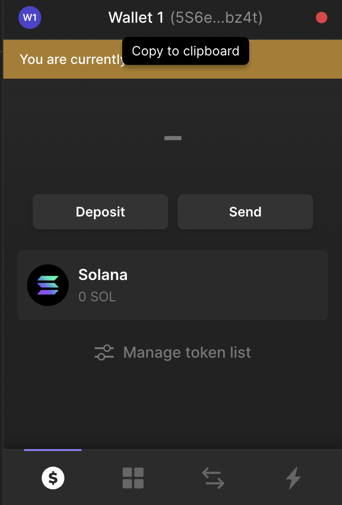
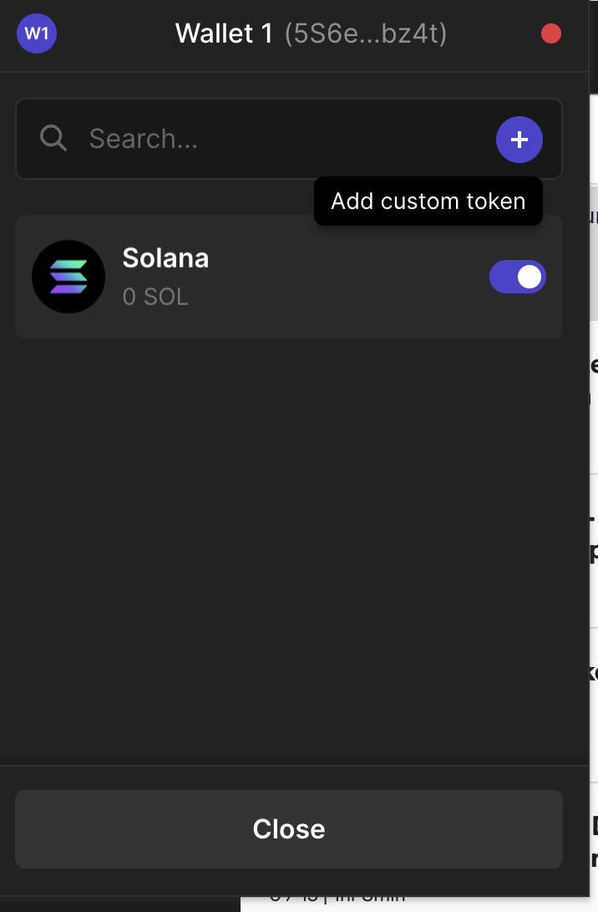
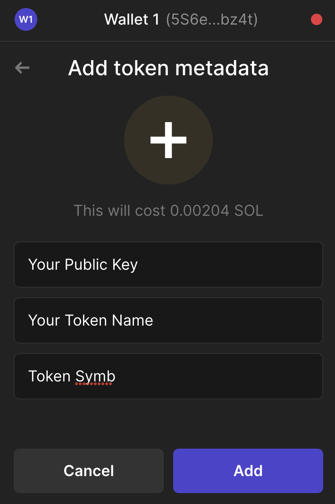

# Using Solana 

* To get a solana wallet [Phantom](https://phantom.app/download) click the link.

Now we are going to send tokens to this wallet.

1. Copy the address at the top of the wallet. See images below 



2. Click the wallet and add a custom token. First click `manage token list` then the plus button. See image below.



3. Add your public key you generated in the terminal, a token name and token symbol. You will need sol to transfer so request sol to the wallet address.



```
solana aidrop 2 publicKey --url devnet 
```

To send tokens from the terminal

```
spl-token transfer tokenAddress amount toPublicKey --url devnet --allow-unfunded-recipient --fund-recipient
```

* To find the tokenAddress look in the list of tokens under `manage tokens`